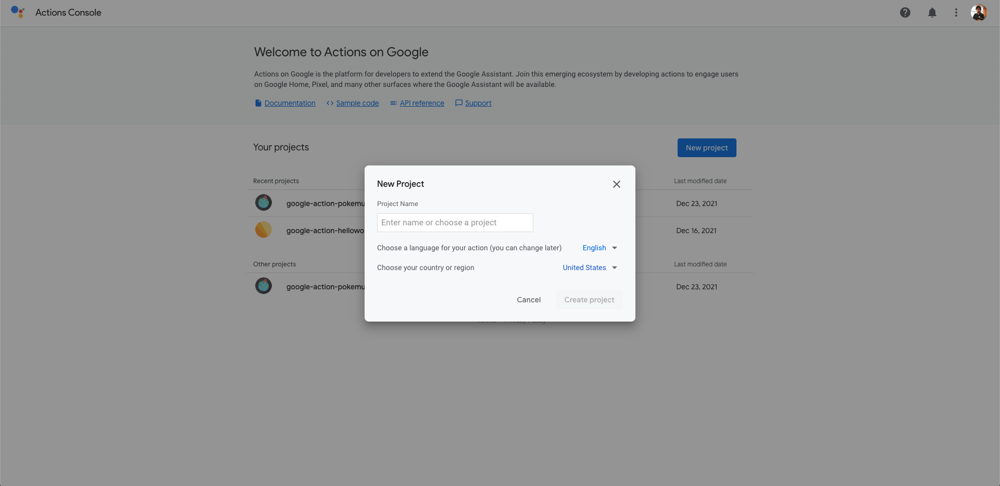
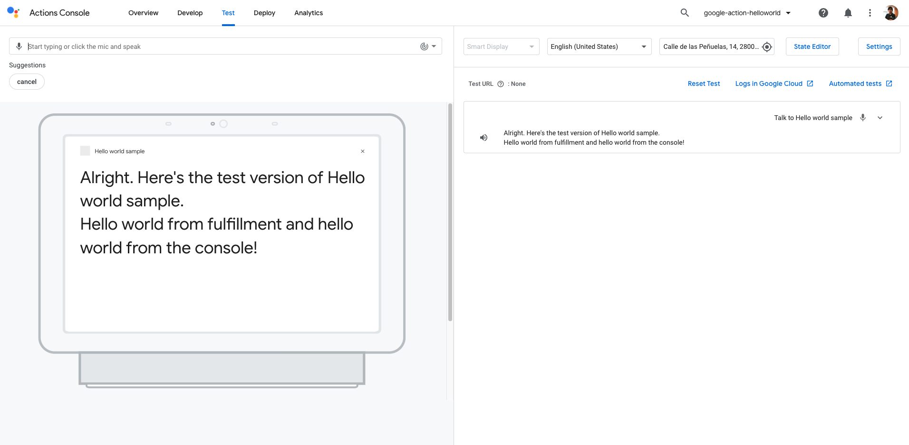

<!-- TOC -->

- [Google Actions with Node.js](#google-actions-with-nodejs)
  - [Prerequisites](#prerequisites)
  - [Creating the Google Action with gactions CLI](#creating-the-google-action-with-gactions-cli)
  - [Project Files](#project-files)
  - [Firebase Cloud function in Javascript](#firebase-cloud-function-in-javascript)
  - [Deploying your Google Action](#deploying-your-google-action)
  - [Testing your Google Action](#testing-your-google-action)
  - [Uploading your code from the Google Action Console](#uploading-your-code-from-the-google-action-console)
  - [Resources](#resources)
  - [Conclusion](#conclusion)

<!-- /TOC -->


# Google Actions with Node.js

Google Actions can be developed using Firebase Cloud functions or a REST API endpoint. 
Firebase Cloud Function function is Googles's implementation of serverless functions available in Firebase. 
Google recommends using Firebase Cloud Function functions for Google Action development.
 
In this post, we will implement a Google Action for Google Assistant by using Node.js, yarn and Firebase Cloud Functions. This Google Action is basically a Hello World example. 

This post contains materials from different resources that can be seen in the Resources section.

## Prerequisites

Here you have the technologies used in this project
1. Google Action Developer Account - [How to get it](https://console.actions.google.com/)
2. Google Cloud Account - [Sign up here for free](https://cloud.google.com/)
3. Firebase Account - [Sign up here for free](https://firebase.google.com/)
4. gactions CLI - [Install and configure gactions CLI](https://github.com/actions-on-google/gactions)
5. Firebase CLI - [Install and configure Firebase CLI](https://firebase.google.com/docs/cli)
6. Node.js v10.x
7. Visual Studio Code
8. yarn Package Manager
9. Google Action SDK for Node.js (Version >3.0.0)
10. ngrok

The Google Actions Command Line Interface (gactions CLI) is a tool for you to manage your Google Actions and related resources, such as Firebase Cloud functions.
gactions CLI allows you to manage Google Actions programmatically from the command line.
We will use this powerful tool to create, build, deploy and manage our Hello World Google Action. Let's start!

## Creating the Google Action with gactions CLI

For creating the Google Action, we will use de gactions CLI previously configured. First of all, we have to execute this command:

```bash

    gactions init hello-world

```
This command has to be executed on an empty directory.

Once you have your Google Action code initialized, you have to go to the [Google Action Console](https://console.actions.google.com/) and create a new project:



Once you have created your Google Action project on the console, you have to get the project ID and put that value in the property `projectId` file `sdk/settings/settings.yaml`:


```yaml
category: GAMES_AND_TRIVIA
defaultLocale: en
localizedSettings:
  displayName: Hello world sample
  pronunciation: Hello world sample
projectId: action-helloworld # Your Project ID here
```

**NOTE:** You can find the Project ID on the Google Actions Console URL while accessing your Google Action. The URL will have this format: `https://console.actions.google.com/u/0/project/<YOUR-PROJECT-ID>/scenes/Start`. In my case will be: `https://console.actions.google.com/u/0/project/action-helloworld/scenes/Start`

And that's it, with these steps you have created your first Google Action and linked to your source code locally using the gactions CLI. You only have to deploy your local changes. We are going to explain it in the next steps.

## Project Files 

These are the main files of the project:

```bash

└── sdk
    ├── actions
    │   └── actions.yaml
    ├── custom
    │   ├── global
    │   ├── intents
    │   ├── scenes
    │   └── types
    ├── manifest.yaml
    ├── settings
    │   └── settings.yaml
    └── webhooks
        ├── ActionsOnGoogleFulfillment
        │   ├── index.js
        │   └── package.json
        └── ActionsOnGoogleFulfillment.yaml

```

* `sdk`: The main folder of the project. Here we will execute all the gactions CLI commands.
  * `actions`:
    * `actions.yaml`: file that contains some metadata of the Google Action such as the Assistant Link.
  * `custom`: In this folder, we are going to specify our interaction model and the conversation flow.
    * `global`: In this folder, you will find all the intents that can be triggered at any time because they are global.
    * `intents`: Intents defined by us. Each intent will have a list of utterances that Google Assistant will use to train its AI.
    * `scenes`: The different Scenes of our Google Actions. We will use Scenes to manage the flow of our conversation.
    * `types`: the types/entities we are going to use on our intents/utterances.
  * `settings`:
    * `settings.yaml`:This file will contain all the metadata of our Google Action like description, logo, Privacy Policy, Project ID, etc.
  * `webhooks`: A folder that contains the source code of the Firebase Cloud function:
    * `ActionsOnGoogleFulfillment`: Folder with all the Firebase Cloud Function code.
      * `index.js`: the Firebase Cloud Function main entry point.
      * `package.json`: this file is core to the Node.js ecosystem and is a basic part of understanding and working with Node.js, npm, and even modern JavaScript
    * `ActionsOnGoogleFulfillment.yaml`: File that specifies the handlers and the folder of the source code.

## Firebase Cloud function in Javascript

The Google Action SDK for Node.js makes it easier for you to build highly engaging google actions by allowing you to spend more time implementing features and less time writing boilerplate code.

You can find documentation, samples and helpful links in their official [GitHub repository](https://github.com/actions-on-google)

The main Javascript file in our Firebase Cloud Function project is `index.js` located in `sdk/webhooks/ActionsOnGoogleFulfillment` folder. This file contains all handlers and exports the Google Action handler in `exports.ActionsOnGoogleFulfillment`.

The `exports.ActionsOnGoogleFulfillment` function is executed every time Firebase is initiated for this particular function. 

```javascript

    const {conversation} = require('@assistant/conversation');
    const functions = require('firebase-functions');

    const app = conversation({debug: true});

    app.handle('start_scene_initial_prompt', (conv) => {
    console.log('Start scene: initial prompt');
    conv.overwrite = false;
    conv.scene.next.name = 'actions.scene.END_CONVERSATION';
    conv.add('Hello world from fulfillment');
    });

    exports.ActionsOnGoogleFulfillment = functions.https.onRequest(app);

```
It is important to take a look into the `start_scene_initial_prompt` as an example of Google Action handler written in Node.js:

```javascript

    app.handle('start_scene_initial_prompt', (conv) => {
    console.log('Start scene: initial prompt');
    conv.overwrite = false;
    conv.scene.next.name = 'actions.scene.END_CONVERSATION';
    conv.add('Hello world from fulfillment');
    });

```

**NOTE:** Every time you add a new handler you have to specify it on `sdk/webhooks/ActionsOnGoogleFulfillment.yaml` file.

## Deploying your Google Action

With the code ready to go, we need to deploy it on Firebase and the Google Actin console so it can be connected to Google Assistant.

Now we can deploy our Google Action with gactions CLI on the `sdk` folder:

```bash
    gactions push
```

This command will do the following actions:

1. Push all the Google Action metadata, interaction model, settings and configurations To the Google Actions Console.
2. Push the code of our Cloud Function to Firebase.

After that, we have to execute this command:
```bash
    gactions deploy preview
```

This command will deploy everything in the `preview` stage of our Google Action. Ready to be tested.


## Testing your Google Action

Once you have deployed your changes, you can go to your Google Action project on the Google Action console and test it:




## Uploading your code from the Google Action Console

Every time you do a change on the google Action Console you can download those changes by running this command:

```bash
    gactions pull
```

Or if you want to overwrite your local changes you can execute this command:

```bash
    gactions pull --force
```
## Resources
* [Official Google Assistant Node.js SDK](https://github.com/actions-on-google/assistant-conversation-nodejs) - Official Google Assistant Node.js SDK
* [Official Google Assistant Documentation](https://developers.google.com/assistant/conversational/overview) - Official Google Assistant Documentation

## Conclusion 

This was a basic tutorial to learn Google Actions using Node.js.
As you have seen in this example, the Google Action SDK for Node.js and the Google Actions Tools like gactions CLI can help us a lot and also they give us the possibility to create Google Actions easily. 
I hope this example project is useful to you.

That's all folks!

Happy coding!